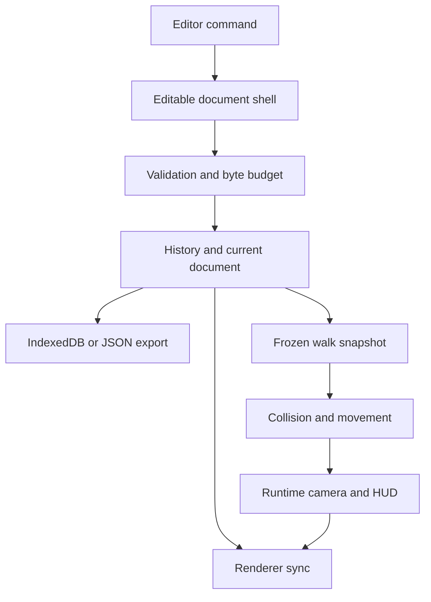
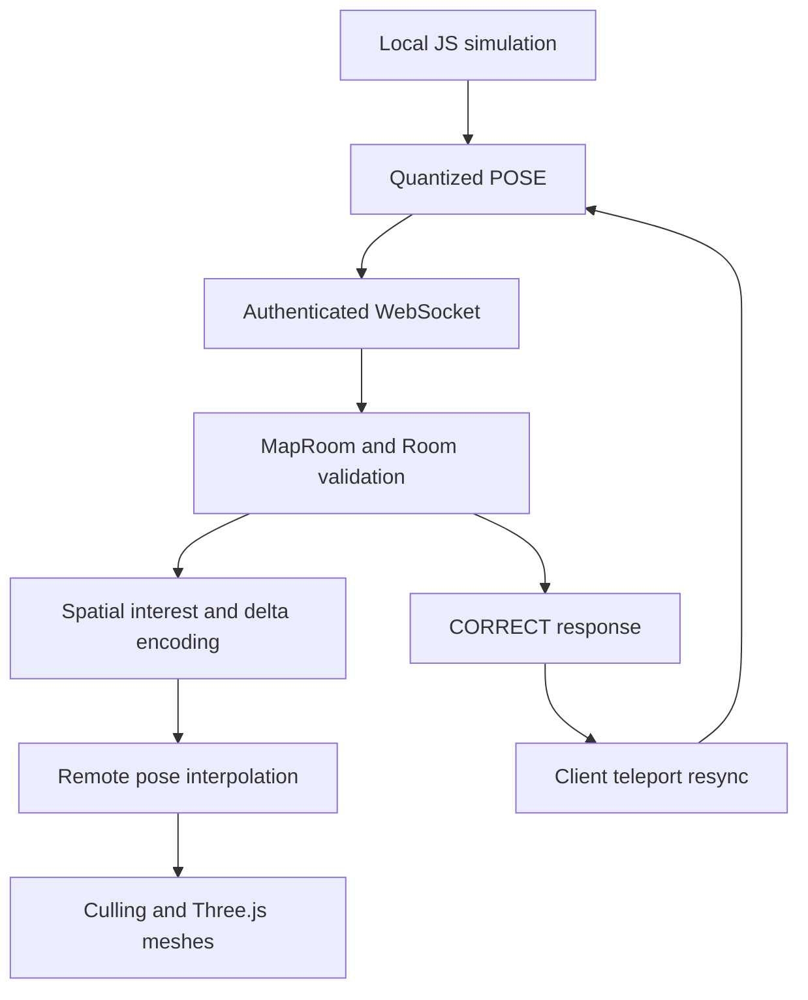

# Architecture: how the current system works

Implementation reviewed 2026-10-06 against e27fd30af1192f8c311bba0ed08181ad43c1347b. The exact public export source is recorded in PUBLIC_SOURCE.json at the repository root. This describes the included code; optional data-backed applications require configuration as explained in [INTEGRATIONS](../INTEGRATIONS.md). See [FINDINGS](../FINDINGS.md) and the [release record](../RELEASE_STATUS.md).

## 1. Applications and execution locations

The repository contains several applications, not one interchangeable world format.

| Application | Browser execution | Persistent state |
| --- | --- | --- |
| Layer editor | DOM and CSS transforms in dist/app.js | Memory-only page state; JSON export with no UI re-import or local restore |
| Map Studio | Three.js WebGL, pure map model, project envelope and editor | IndexedDB per world; explicit JSON export |
| World Studio | Three.js WebGL, procedural dioramas, scan/city loaders | World documents in localStorage; city storage separately in IndexedDB |
| Kart | Three.js WebGL, JavaScript controllers, fixed-step loop, WebSocket client | Runtime state in memory; optional telemetry and realtime |
| Globe | CesiumJS, streamed imagery/terrain/tiles, JavaScript controllers | Streamed resources; no common editor document |
| Cloudflare Worker | Authentication, API routing, Durable Objects and R2 adapters | Hosted scene/geodata/cache/telemetry objects; ephemeral room state |
| Rust module | Prebuilt WASM with explicit linear-memory layout | Numeric state in WASM memory; MapRoom uses it for terrain sampling |

The regular local start needs Node 24+, not Rust. Rust is needed to rebuild the committed simulation WASM. No Makepad, wgpu-core, wasm-bindgen, subgroup-matrix kernel, SharedArrayBuffer transport or WebTransport path is wired into this baseline.

## 2. Map edit and walk flow

[editor.js](../../dist/map-studio/editor.js) coordinates the UI. [model.js](../../dist/map-studio/model.js) owns normalized data, validation and undo history. It does not own DOM or Three.js objects. [renderer.js](../../dist/map-studio/renderer.js) derives render state from documents and reports user edits through callbacks.

Validated documents are deeply frozen. A normal edit copies the document shell, replaces changed points, then validates the result. Unchanged validated points retain their identity. The shared validation marker and JSON cache live in [runtime/frozen.js](../../dist/runtime/frozen.js). This avoids revalidating and serializing every unchanged point on every edit.

Dragging has exclusive ownership of the edit. Other edits, undo/redo and project replacement are refused while a drag is active. Drop produces one validated history step. Do not mutate a validated point in place.

Map history holds up to 35 steps. Entries share serialized point texts and deduplicate images; this is not a promise of zero memory use. CityLayer updates affected geometry rather than rebuilding every point for an inspector edit.

## 3. Formats, coordinates and budgets

| Format | Current use | Important boundary |
| --- | --- | --- |
| motionspec.map.v3 | Map payload; reads/migrates v1 and v2 | Pure validated points, ground and runtime spawn |
| ourark.map-project.v1 | File and IndexedDB envelope | worldId, optional workspaceId/geoReference, local revision and map payload |
| motionspec.world.v1 | World Studio scene | Template-dependent geometry; not all asset bytes |
| motionspec.scan.v1 | Content-addressed prepared scan bundle | Scene GLB, camera/collider/lighting data and integrity checks |
| motionspec.kart.track.v1 | Kart terrain/track asset manifest | Binary heights/buildings/trees and images are separate files |
| Realtime protocol v1 | Compact movement messages | Quantized pose, not editable project data |
| Sim layout v1 | 64-byte entity record | f32 state suitable for WASM/GPU transfer |
| SimSnapshot | Local full controller state in Float64Array | Exact local save/load/replay helper, not the wire format |
| motionspec.world-package.v2 | Draft complete-world archive contract | No shipping complete-package importer/exporter |

Map units are metres: +X east, +Y up, +Z south; image top is north/-Z. Map/walk headings in documents use **degrees**; vehicle/network headings use **radians**. Normalize at adapters.

Current map bounds: 5,000 points, map sides 10–5,000 m, point positions ±2,500 m, 64 vertices per footprint and 100,000 total footprint vertices. Ground allows 20,000 surfaces and 400,000 total surface points, subject to per-surface limits. These are validation ceilings, not performance guarantees.

Map image upload is limited to 4 MiB and 8192 px per side; the document image allowance is nominally 8 MiB and implemented as a data-URL string-length ceiling of MAX_IMAGE_BYTES × 1.4. It is not exact decoded-byte accounting. Project import/export/edit accounting uses the exact UTF-8 serialization and a 16 MiB budget. Existing oversized local projects can be backed up and reduced; an oversized backup is explicitly not re-importable. See the [envelope contract](../../contracts/map-project-v1.md).

The network coordinate range is smaller: representable position ±2,047.9375 m, room X/Z acceptance ±2,000 m. Map Studio exposes the mismatch through mapFitsNetwork. Map Studio multiplayer itself is not connected.

## 4. Storage and portability

Map IndexedDB database motionspec-map-studio-v1, store projects:

| Key | Value |
| --- | --- |
| project:<worldId> | Project envelope |
| last | Most recently saved world ID (or the migration-selected project) |
| current | Legacy project retained as migration input |

Save is compare-and-set inside one readwrite transaction. It increments the revision only if the stored revision matches the open project. A conflicting tab receives SaveConflict; it does not silently overwrite. This revision is local, not a server revision. Migration copies and verifies legacy data before switching the last pointer.

Opening a stored project through `loadProject()` and the editor's local-project list does not change `last`. Saving A, saving B, opening A without saving, then reloading restores B. Only a subsequent save makes A the restore target.

World Studio uses localStorage for diorama documents and [city-store.js](../../dist/world-studio/city-store.js) for city data. Neither store is cloud synchronization. Copying or publishing this repository does not copy a user's browser data.

The layer editor initializes its state from in-code defaults on each page load. It has no storage write or UI import path. Its export includes layers, view and display preferences for inspection/developer reuse, but reload or navigation discards the editable session. This is separate from both Map Studio's project round trip and World Studio's storage.

The public source ZIP includes the curated tracked files and a self-contained starter. It excludes original artwork/geodata/scans, historical material, owner deployment configuration, hosted R2 objects, services from other repositories and private browser state.

## 5. Walking and simulation clocks

[RuntimeSession](../../dist/runtime/session.js) transitions through editing → loading → playing ↔ paused → editing. It clones and freezes the design document before preparing physics. Failures and cancelled loads return safely to editing. Exit restores the editor; runtime movement never creates edit history entries.

[walk-host.js](../../dist/runtime/walk-host.js) adapts both editors to the session. [map-adapter.js](../../dist/runtime/map-adapter.js) converts map data into collision shapes. [physics/adapter.js](../../dist/runtime/physics/adapter.js) implements a circle/prism controller, collision sliding, movement subdivision, spawn search and spatial broadphase. This is a specialized movement controller, not a general rigid-body physics engine.

| Loop | Step | Rendering |
| --- | --- | --- |
| Editor walking | 1/60 s, at most 5 catch-up steps; frame gap capped at 0.25 s | FrameLoop render callback |
| Kart/plane/walker | 1/120 s; frame gap capped at 0.25 s | FrameLoop and interpolation |
| Globe controllers | 1/120 s with a capped accumulator | Cesium preRender path |
| Multiplayer room | 50 ms message tick | Client interpolates remote poses |

Simulation frequency does not equal rendered FPS. Actual frame rate depends on browser scheduling, device, resolution and scene. The globe does not currently use the shared FrameLoop.

## 6. Rust/WASM and GPU boundaries

[sim/src/lib.rs](../../sim/src/lib.rs) implements car, plane and pedestrian rules in f32 state. [wasm.js](../../dist/runtime/sim/wasm.js) exposes typed views onto WASM memory. That avoids a JavaScript repacking copy. GPU queue.writeBuffer still performs an upload, and optional culling reads its result back.

The browser's main kart/globe controllers are JavaScript. MapRoom loads the WASM module and terrain grid for ground-height plausibility checks; it does not step every client's vehicle authoritatively.

[EntityCuller](../../dist/runtime/gpu/cull.js) can use CPU rules or a WGSL compute pass. The kart defaults to CPU for at most 64 remote records. Add gpu=1 to the kart query string to request WebGPU; initialization/device errors fall back to CPU. WebGPU does not replace the Three.js WebGL renderer.

Culling measurements report the whole awaited operation, including upload and readback. Node tests cover CPU rules and failure fallback; they do not prove GPU execution on a real adapter.

## 7. Realtime networking

One MapRoom Durable Object serves each map. Room checks position bounds, movement rate and terrain plausibility. It distributes visible players using 64 m cells, distance-based refresh and acknowledged delta states. Capacity is 64 players per room; this is a configured limit, not a concurrent-load guarantee.

The protocol has 12-byte headers and 16-byte full records, with a variable-length delta form. Quantized positions have 1/16 m resolution. The 64-byte in-memory EntityStore is a different layout.

The current kart correction callback re-announces its current pose with a teleport flag. Although SimSnapshot has replay tests, authoritative rollback/replay is not connected to this correction path. Do not advertise authoritative anti-cheat physics or complete rollback netcode.

The local server implements loopback WebSocket rooms. The hosted Worker additionally requires authentication and same-origin upgrades. Browser socket state, Durable Object runtime state and project persistence are separate concerns.

## 8. Assets, scans and geospatial data

- worldport converts planar CSV coordinates (including columns named lat/lng) and geographic Overpass JSON into map payloads. The CSV path applies a scale, not WGS84 degree-to-metre conversion. It reports conversion/limit outcomes; it does not infer 3D geometry from arbitrary photos.
- Scan loading fetches prepared same-origin bundles and verifies hashes. Loading/baking/reconstruction are different operations. The complete worldscan reconstruction service is outside this repository.
- The original kart integration expects packed height grids, buildings, tree records and aerial photos. These original datasets are excluded from the public release. Delta-plane plus gzip height packing is lossless relative to the input grid. Rendering first uses a preview, then loads the full image.
- The globe integration uses Cesium 1.138.0 and expects online imagery/terrain, a local model and optional county 3D Tiles. The original local models and hosted county dataset are excluded. The public /globe/ route is an integration guide; original application startup is retained in integration.html.
- County regeneration scripts assume build-machine paths and inputs, including /root/geo-kronach, a virtual environment, tiles.json, landkreis.geojson and gltfpack. They are not yet a portable one-command clean-clone build.
- Image enhancement calls a separately deployed renderboost origin. The local server returns 503 when its URL/token are absent.
- Google tiles require a suitably restricted browser key and current provider terms. A browser key returned by the config endpoint is visible to authenticated clients; it is not a hidden server-only credential.

These boundaries matter when promising “everything included”. See [THIRD_PARTY_NOTICES](../../THIRD_PARTY_NOTICES.md) and the [release record](../RELEASE_STATUS.md).

## 9. Hosting and data leaving the browser

The authored static source is served from the origin root. Absolute asset URLs mean a project subpath needs adaptation. Node's development server binds to loopback by default and is not a production authentication server.

The original Worker expects ASSETS; LoginGuard and MapRoom Durable Objects; and RB_CACHE, SCENES and GEO R2 bindings. Owner-specific wrangler configuration and deployment workflows are excluded. Integrators must deliberately create and test their own configuration; publishing this source creates no infrastructure.

| Path | Function / data movement |
| --- | --- |
| /api/enhance | Sends an explicitly selected image through the Worker to renderboost; optional R2 cache |
| /api/scenes, /scenes/<id>/… | Lists and retrieves prepared scan bundles |
| /geo/<set>/… | Serves hosted geographic tiles/surface data |
| /api/realtime | Sends movement poses and receives other players' poses |
| /api/kart-telemetry, /api/kart-insights | Collects/aggregates performance and movement samples; switch in the kart panel |
| /api/device-check | Accepts device checks; local development acknowledges without storing |
| /api/globe-config, /api/geocode | Optional browser key configuration and Nominatim search proxy |

net=0 only disables realtime. It does not disable telemetry or external globe requests. Kart telemetry has a separate browser preference. Do not claim the whole product makes no network requests.

Worker auth fails closed without configured credentials/guard. The local server supplies API stand-ins, not identical production storage or auth. Successful tests of these stand-ins do not establish live service health.

## 10. Verification and documentation index

Run `npm run verify` for Node/syntax/reference checks and the generated index. `npm run test:browser` requires the public smoke and audit regressions to pass; `npm run test:browser:public` runs only the smoke. Missing Playwright/Chromium is a failure. The original broader suites remain under `npm run test:browser:extended`; their shared harness uses SwiftShader on Linux, Metal on macOS and the platform default elsewhere, while some suites still expect excluded fixtures or hardware-specific budgets. Software-rendered checks do not establish physical GPU/FPS performance. Real Safari, Firefox, mobile, touch and accessibility coverage must be recorded separately.

The generated register covers all tracked files plus unignored new files, with exact byte hashes. Its tokenizer indexes authored JavaScript module-level symbols, DOM references and styles; it does not parse Rust symbols. It does not prove runtime correctness or automatically verify prose. Some DOM references are heuristic. Regenerate after changes with npm run docs:architecture.

Evaluate the public verification result for the exact public tree. Original private-repository CI and deployment statuses do not establish a working public package or live revision. This public repository has no automatic deployment workflow.
